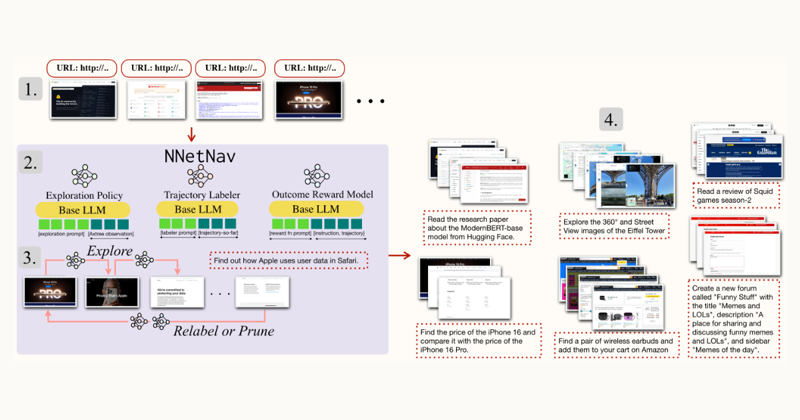

# NNetscape Navigator: Complex Demonstrations for Web Agents Without a Demonstrator

<div align="center">

</div>

If you just want the NNetNav-6k dataset, you can download it via huggingface:

```python
from datasets import load_dataset

ds = load_dataset("smurty/NNetNav-6k")
```

If you want to generate your own synthetic demonstrations and learn how to use the finetuning code, read on!

## Table of Contents

- [Project Structure](#project-structure)
- [Environment Setup](#environment-setup)
- [Setting Environment Variables](#environment-variables)
- [Collecting Demonstrations](#collecting-demonstrations)
- [Converting Demonstrations for Supervised Finetuning (SFT)](#postprocessing-for-supervised-finetuning)
- [Finetuning LLama with NNetNav Demonstrations](#sft-ing-llama-with-nnetnav-demonstrations)
- [Evaluating a Trained Agent](#evaluating-a-trained-agent)
- [Contributing](#contributing)
- [Citation](#citation)

---
## Project Structure

```plaintext
NnetscapeNavigator/
├── src/
│   ├── agent/
│   ├── browser_env/
│   ├── postprocess_outputs.py          # Simple book-keeping script  
│   └── postprocess_trajectories.py     # Add stop action / retroactive reasoning            
│   ├── nnetnav_utils.py                # Contains main logic for exploration / pruning
│   └── run_nnetnav.py                  # Entry point for running nnetnav
├── scripts/                            # Executable scripts 
│   ├── convert_to_sft.py
│   ├── merge_log_files.py
│   └── ...
├── notebooks/
│   ├── analyze_demonstration_quality.ipynb
│   ├── explore_config_files.ipynb
│   └── ...
├── evaluation/
│   ├── eval_miniwob.py
│   ├── eval_webarena.py
│   └── get_per_domain_acc.py
│   ├── run_lm_reward.py
│   └── ...
├── finetuning/
│   ├── scripts/
│   ├── data/
│   └── open_instruct/
│   └── ...
│   
├── setup.py
├── requirements.txt             # Dependencies
└── README.md
```
---

## Environment Setup

```bash
conda create -n agents python=3.10.14;
pip install -r requirements.txt
pip install -e .
```

This codebase uses two environments, MiniWoB++ and WebArena. For setup instructions follow:
- [WebArena Setup](https://github.com/web-arena-x/webarena)
- [MiniWoB++ Setup](https://github.com/ServiceNow/BrowserGym/blob/main/browsergym/miniwob/README.md)

If you run into issues with either setup, please open an issue on the respective repostories. Note that correctly setting up environments is a pre-requisite for the rest of the code

---
## Environment variables

Make sure the following environment variables have been set up:

```bash
export SHOPPING="<SHOPPING_URL>"
export SHOPPING_ADMIN="<SHOPPING_ADMIN_URL>"
export REDDIT="<REDDIT_URL>"
export GITLAB="<GITLAB_URL>"
export MAP="<MAP_URL>"
export WIKIPEDIA="<WIKIPEDIA_URL>"
export HOMEPAGE="<HOMEPAGE_URL>"
export OPENAI_API_KEY=<OPENAI_KEY>
export MINIWOB_URL=<MINIWOB_URL>
export LLAMA_API_KEY=<LLAMA_API_KEY>
```

Here, note that `LLAMA_API_KEY` is needed to make calls to a vLLM endpoint. Assuming you have installed vLLM correctly, here's how to create a vLLM endpoint

```bash
vllm serve --model meta-llama/Meta-Llama-3-8B-Instruct --api-key smurty-llama-8b-instruct 
```
and then set `LLAMA_API_KEY=smurty-llama-8b-instruct`. 

---
## Collecting demonstrations

The starting point for running NNetNav is src/run_nnetnav.py. Here's how to run it:

```bash
python src/run_nnetnav.py \
  --model gpt-4o-mini \
  --result_dir EXPLORATION_NNETNAV \
  --filter_dir DATA_NNETNAV \
  --seed_dir seed_states_webarena/ \
  --exploration_size_per_seed 100 \
  --use_personas
```

**Important note on seed_dir**: Here, seed_states is all the starting configs for setting up browser state. WebArena has 5 websites, and so there are 5 seed states. Make sure to correctly configure the `start_url` based on your webarena setup!


After this, run:
```bash
python postprocessing/postprocess_outputs.py \
  --orig_dir EXPLORATION_NNETNAV \
  --filter_dir DATA_NNETNAV
```

And then finally run:
```bash
python src/postprocess_trajectories.py \
  --model gpt-4o-mini \
  --data_dir DATA_NNETNAV \
  --environment_type webarena \
  --n_jobs 10
```

This will give you demonstrations saved in DATA_NNETNAV. If you're using a vLLM endpoint (e.g. meta-llama/Meta-Llama-3-8B-Instruct), replace `gpt-4o-mini` with `meta-llama/Meta-Llama-3-8B-Instruct`.
---
## Postprocessing for Supervised Finetuning

Next, we convert demonstrations into (input, output) pairs for an LLM agent. The following will create a data.jsonl file that can be directly used for supervised finetuning!

```bash
python scripts/convert_to_sft.py \
  --nnetnav_dem_dir DATA_NNETNAV \
  --output_dir finetuning/data/processed/my_nnetnav_data
```

---
## SFT-ing LLama with NNetNav demonstrations
If you correctly followed all the steps till now, you should be able to train your own local LLama web-agent. To do this, first `cd finetuning`. Then, launch

```bash
./scripts/finetune_with_accelerate.sh
```

And let the GPUs go brr. The script is configured for my personal setup. Feel free to modify it for your own setup (e.g. change `CUDA_VISIBLE_DEVICES` and `NUM_GPUS` and `output_dir`).

---
## Evaluating a trained agent
First, launch a vLLM server with the new local llama model

```bash
vllm serve --model /path/to/local/llama --api-key smurty-llama-8b-instruct 
```

To evaluate on WebArena, first reset the WebArena environment (check out WebArena setup for this). Then run:

```bash
python evaluation/eval_webarena.py \
    --model /path/to/local/llama \
    --result_dir llama_8b_nnetnav \
    --instruction_path src/agent/prompts/jsons/p_cot_llama_action_history.json \
    --test_end_idx 800
```

---
## Contributing

Contributions are welcome! If you encounter any issues, feel free to open a GitHub issue or submit a pull request.

---

## Citation

If you use NNetNav in your work, please cite us using the following BibTeX entry:

```bibtex
@article{murty2024nnetscape,
  title={NNetscape Navigator: Complex Demonstrations for Web Agents Without a Demonstrator},
  author={Murty, Shikhar and Bahdanau, Dzmitry and Manning, Christopher D},
  journal={arXiv preprint arXiv:2410.02907},
  year={2024}
}
```