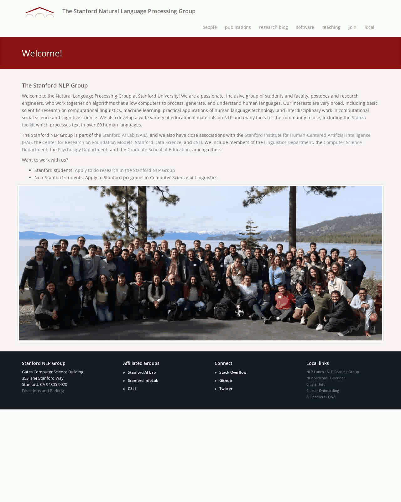
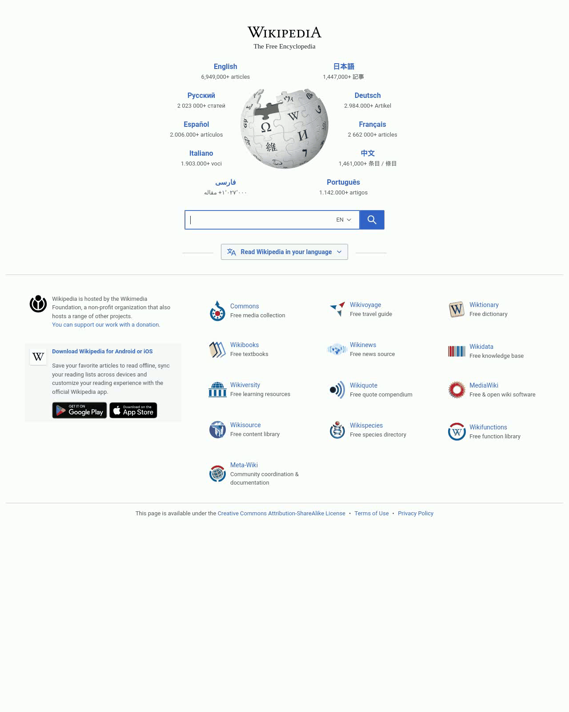

# NNetNav: Unsupervised Learning of Browser Agents Through Environment Interaction in the Wild
[<a href="https://nnetnav.dev">Project Website</a>] 


If you just want the NNetNav datasets, you can download it via huggingface:

```python
from datasets import load_dataset

ds = load_dataset("stanfordnlp/nnetnav-live")
ds = load_dataset("stanfordnlp/nnetnav-wa")
```

And, if you want to just use our pre-trained models as an agent on websites,  you can do so via the following:

```bash
pip install -U "huggingface_hub[cli]"
huggingface-cli download stanfordnlp/llama8b-nnetnav-wa
huggingface-cli download stanfordnlp/llama8b-nnetnav-live
```

> ⚠ **Disclaimer**  
> By using these models, you acknowledge and accept that the models operates autonomously on live websites, making decisions and taking actions on your behalf. Some of these actions may not align with your intentions.  
>  
> **You assume full responsibility and liability** for any and all actions taken by the model, whether intended or unintended. The developers and contributors of this project are not responsible for any consequences, legal or otherwise, that may arise from its use.  
>  
> We strongly **recommend against using this model** on websites where unintended actions could cause **harm, financial loss, legal consequences, or violate terms of service.**  
>  
> **Use this software at your own risk.**


We advise using `llama8b-nnetnav-live` for live websites, and `llama8b-nnetnav-wa` for WebArena. Next, serve it via VLLM (make sure you have the resources to host a Llama-8B model)
```bash
vllm serve --model /path/to/llama8b-nnetnav-live --api-key <your-api-key>
```

Then run the following to use the agent on a website (say https://www.nlp.stanford.edu) with an instruction (say: "Find the list of current PhD students in the NLP group")

```bash
python src/run_agent.py \
    --model /path/to/llama8b-nnetnav-wa \
    --result_dir llama_openended \
    --instruction_path src/agent/prompts/jsons_openweb/p_cot_llama_action_history.json \
    --agent_name llama8b-netnav-wa \
    --n_jobs 1 --data openended
```

The script will prompt you to enter a URL and an instruction. After that, it will run the agent on the website and save the results in the specified directory. Below are some examples:


<table>
  <tr>
    <td style="text-align: center;">
      
      <br>
      <strong>Find the list of current faculty in the NLP group</strong>
    </td>
    <td style="text-align: center;">
      
      <br>
      <strong>Tell me the population of California</strong>
    </td>
    <td style="text-align: center;">
      
      <br>
      <strong>What is the origin of Thieboudienne?</strong>
    </td>
  </tr>
</table>


Note that nlp.stanford.edu and wikipedia.org are completely out-of-domain for LLama8b-NNetNav-Live (full list of websites used for training can be found in the paper). As with any ML model, LLama8b-NNetNav-Live works better on in-domain websites. If you want to create a NNetNav-ed model for your own websites, and train your own web agents, then read on!


## News
- [02/04/2025]: NNetNav is now using AgentLab + BrowserGym.
- [02/04/2025]: Major updates to NNetNav - SoTA models, new datasets, evals on live websites! 
- [11/18/2024]: Github repo released, along with NNetNav-6k dataset.

## Table of Contents

- [Project Structure](#project-structure)
- [Environment Setup](#environment-setup)
- [Setting Environment Variables](#environment-variables)
- [Collecting Demonstrations](#collecting-demonstrations)
- [Converting Demonstrations for Supervised Finetuning (SFT)](#postprocessing-for-supervised-finetuning)
- [Finetuning LLama with NNetNav Demonstrations](#sft-ing-llama-with-nnetnav-demonstrations)
- [Evaluating a Trained Agent](#evaluating-a-trained-agent)
- [Contributing](#contributing)
- [Citation](#citation)

---
## Project Structure

```plaintext
NnetscapeNavigator/
├── src/
│   ├── agent/
│   ├── browser_env/
│   ├── llms/
│   ├── postprocess_outputs_agentlab.py          # Simple book-keeping script  
│   └── postprocess_trajectories_agentlab.py     # Add stop action / retroactive reasoning            
│   ├── nnetnav_utils.py                         # Contains main logic for exploration / pruning
│   └── run_nnetnav.py                           # Entry point for running nnetnav
│   └── run_agent.py                             # Entry point for running an agent (e.g. LLama-NNetNav-WA)
├── scripts/                            # Executable scripts 
│   ├── convert_to_sft_agentlab.py
│   ├── merge_log_files.py
│   └── ...
├── notebooks/
│   ├── analyze_demonstration_quality.ipynb
│   ├── explore_config_files.ipynb
│   └── ...
├── evaluation/
│   ├── eval_miniwob.py
│   └── get_per_domain_acc.py
│   ├── run_lm_reward.py
│   └── eval_webvoyager.py
│   
├── setup.py
├── requirements.txt             # Dependencies
└── README.md
```

## Environment Setup

```bash
conda create -n agents python=3.10.14;
pip install -r requirements.txt
pip install -e .
```

This codebase uses two environments, MiniWoB++ and WebArena. For setup instructions follow:
- [WebArena Setup](https://github.com/ServiceNow/BrowserGym/blob/main/browsergym/webarena/README.md)
- [MiniWoB++ Setup](https://github.com/ServiceNow/BrowserGym/blob/main/browsergym/miniwob/README.md)

If you run into issues with either setup, please open an issue on the respective repositories. Note that correctly setting up environments is a pre-requisite for the rest of the code

## Environment variables

Make sure the following environment variables have been set up:

```bash
export WA_SHOPPING="<SHOPPING_URL>"
export WA_SHOPPING_ADMIN="<SHOPPING_ADMIN_URL>"
export WA_REDDIT="<REDDIT_URL>"
export WA_GITLAB="<GITLAB_URL>"
export WA_MAP="<MAP_URL>"
export WA_WIKIPEDIA="<WIKIPEDIA_URL>"
export WA_HOMEPAGE="<HOMEPAGE_URL>"
export OPENAI_API_KEY=<OPENAI_KEY>
export MINIWOB_URL=<MINIWOB_URL>
export LLAMA_API_KEY=<LLAMA_API_KEY>
export TOGETHER_API_KEY=<TOGETHER_API_KEY>
```

Here, note that `LLAMA_API_KEY` is needed to make calls to a vLLM endpoint. Assuming you have installed vLLM correctly, here's how to create a vLLM endpoint

```bash
vllm serve --model meta-llama/Meta-Llama-3-8B-Instruct --api-key smurty-llama-8b-instruct 
```
and then set `LLAMA_API_KEY=smurty-llama-8b-instruct`. 

## Collecting demonstrations

The starting point for running NNetNav is src/run_nnetnav.py. Here's how to run it:

```bash
python src/run_nnetnav.py \
  --model meta-llama/Meta-Llama-3.1-70B-Instruct \
  --result_dir EXPLORATION_NNETNAV \
  --filter_dir DATA_NNETNAV \
  --seed_dir seed_states_openended/ \
  --exploration_size_per_seed 100 \
  --n_jobs 4 --use_personas \
  --environment_type openweb
```

**Important note about seed_dirs**: seed_states specify some metadata about websites that we will be running exploration on. WebArena has 5 websites, and so there are 5 seed states. Make sure to correctly configure the `start_url` based on your webarena setup! For Live-websites (WebVoyager subset), these seed_states look something like this:

```json
{
  "sites": ["google_flights"],
  "start_url": "https://www.google.com/flights",
  "geolocation": null,
  "require_reset": false,
  "storage_state": null,
  "intent": "n/a",
  "env_type": "open_ended"
}
```

If you want to run NNetNav on a custom website, you can create your own seed_states!

After this, run:
```bash
python postprocessing/postprocess_outputs_agentlab.py \
```

And then finally run:
```bash
python src/postprocess_trajectories_agentlab.py \
  --model meta-llama/Meta-Llama-3.1-70B-Instruct \
  --data_dir DATA_NNETNAV \
  --environment_type webarena \
  --n_jobs 10
```

This will give you demonstrations saved in DATA_NNETNAV. 


## Postprocessing for Supervised Finetuning

Next, we convert demonstrations into (input, output) pairs for an LLM agent. The following will create a data.jsonl file that can be directly used for supervised finetuning!

```bash
python scripts/convert_to_sft_agentlab.py \
  --nnetnav_dem_dir DATA_NNETNAV \
  --output_dir finetuning/data/processed/my_nnetnav_data
```

## SFT-ing LLama with NNetNav demonstrations
If you correctly followed all the steps till now, you should be able to train your own local LLama web-agent. To do this, we suggest using [OpenInstruct](https://github.com/allenai/open-instruct). 


## Evaluating a trained agent
First, launch a vLLM server with the new local llama model

```bash
vllm serve --model /path/to/local/llama --api-key <your-api-key>
```

To evaluate on WebArena, first reset the WebArena environment (check out WebArena setup for this). Then run:

```bash
python src/run_agent.py \
    --model /path/to/local/llama \
    --result_dir my_webarena_results \
    --instruction_path src/agent/prompts/jsons/p_cot_llama_action_history_bgym.json \
    --agent_name my_nnetnav_llama \
    --n_jobs 1 --data webarena
```
Unfortunately, WebArena evals need to be run sequentially due to dependencies between tasks. Fortunately, WebVoyager evals can be run in parallel!
To evaluate on WebVoyager by parallelizing across multiple jobs, run:

```bash
python src/run_agent.py \
  --model /path/to/local/llama \
  --result_dir my_llama_results \
  --instruction_path src/agent/prompts/jsons_openweb/p_cot_llama_action_history.json \
  --agent_name my_nnetnav_llama \
  --n_jobs 8 --data webvoyager
```

## Contributing

Contributions are welcome! If you encounter any issues, feel free to open a GitHub issue or submit a pull request.


## Citation

If you use NNetNav in your work, please cite us using the following BibTeX entry:

```bibtex
@article{murty2024nnetscape,
  title={NNetNav: Unsupervised Learning of Browser Agents Through Environment Interaction in the Wild},
  author={Murty, Shikhar and and Zhu, Hao and Bahdanau, Dzmitry and Manning, Christopher D},
  journal={arXiv preprint arXiv:2410.02907},
  year={2024}
}
```
